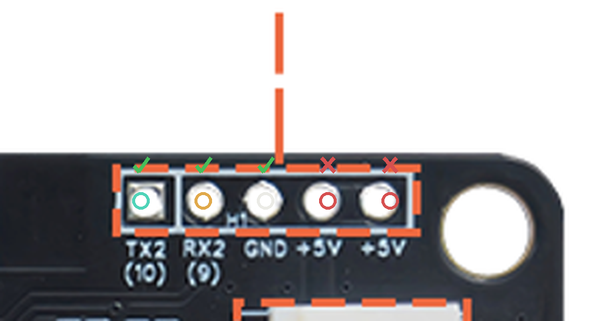
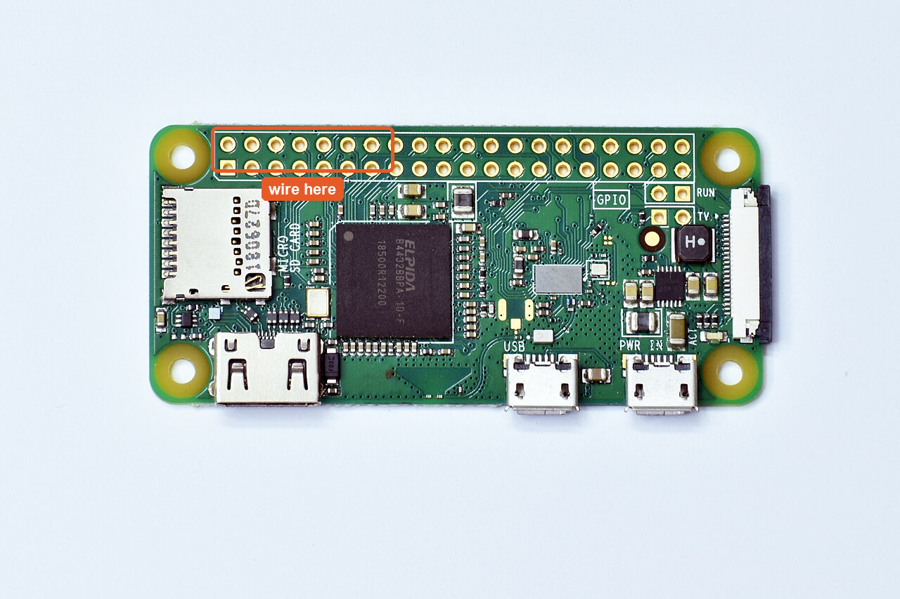
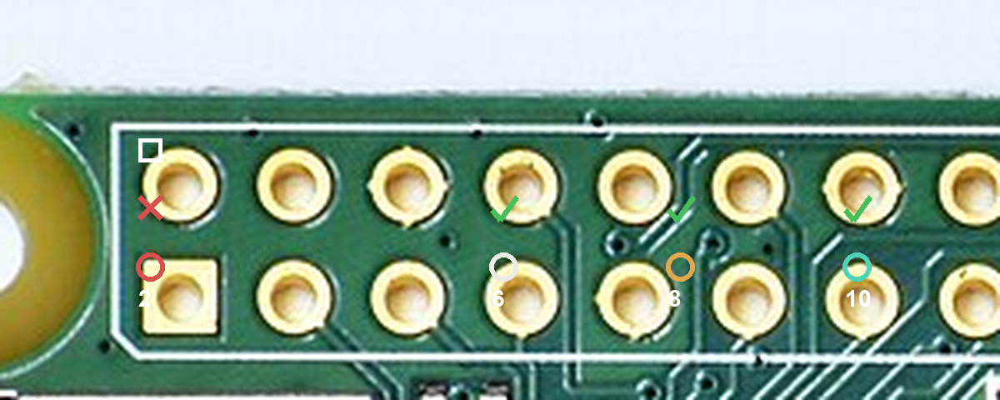
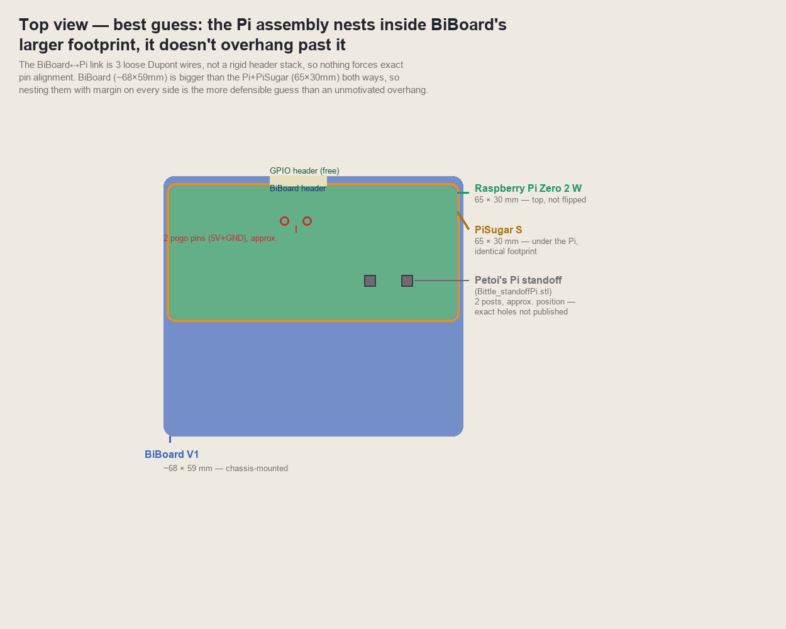
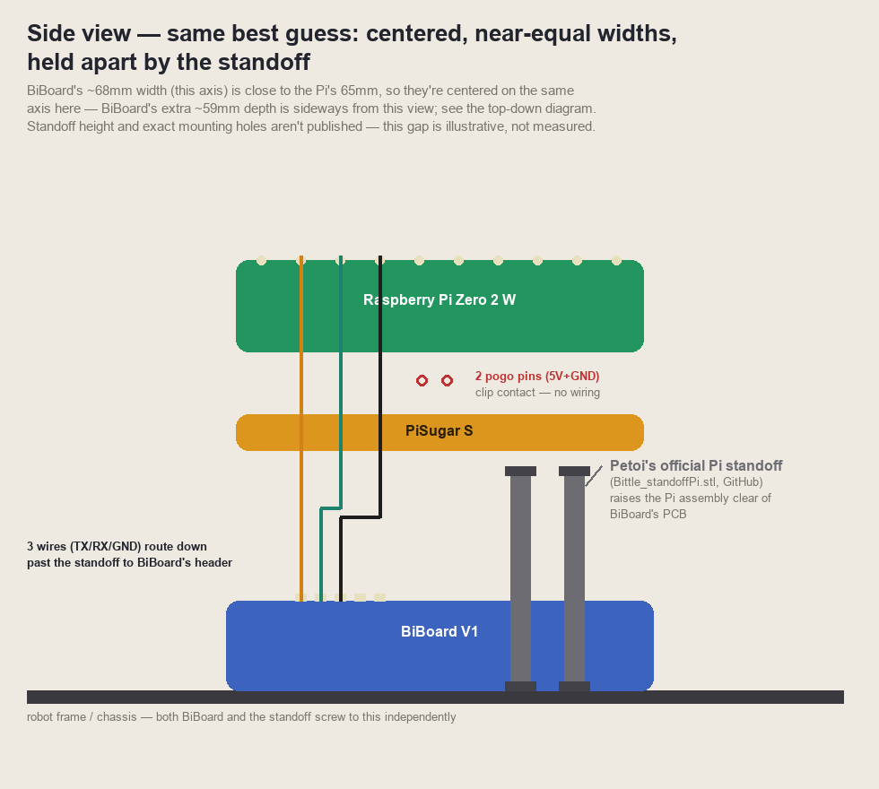
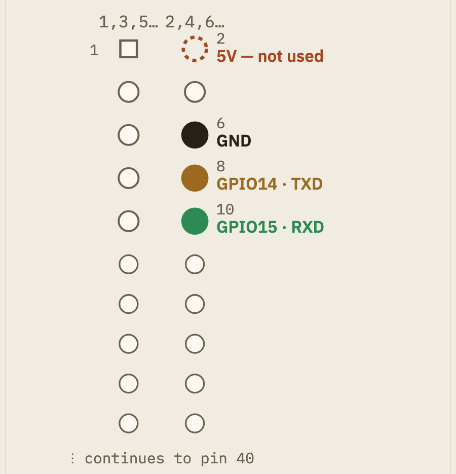

# Wiring PiSugar, the Pi, and BiBoard together

How G2's three electronics pieces connect and mount: PiSugar (Pi power), the
Raspberry Pi Zero 2 W (voice/vision/memory), and BiBoard (walking/servos).
Ordered as a build manual — follow the steps in order; background/research
material that isn't needed to complete a step is marked as such and can be
skipped on a first read.

```
PiSugar S  --5 pogo pins (header solder joints), 4 screws, no wiring-->  Pi Zero 2 W  --3 wires (TX/RX/GND)-->  BiBoard V1
```

## Before you start

### What you'll need

- [ ] Raspberry Pi Zero 2 **WH** (header pre-soldered)
- [ ] PiSugar S, with its 4 mounting screws (included in the PiSugar box)
- [ ] BiBoard V1 — check whether Petoi included a ready-made BiBoard&harr;Pi
      cable in the Bittle X box before doing anything below; if so, skip to
      Step 3
- [ ] A 5-pin header to solder onto BiBoard, if one isn't already there
- [x] Female-to-female Dupont jumper wires — 40pc/10cm in hand (2026-09-18).
      Still need a couple of **longer** ones (20&ndash;30cm), not just the
      standard short ones, once the final mount position is decided; see
      [Step 5](#step-5--mount-the-assembled-stack-to-the-frame)
- [ ] Soldering iron + solder, only if BiBoard's header isn't already
      populated
- [ ] M2 pan-head self-tapping screws, small mixed assortment (6&ndash;12mm)
      — see [Screws to buy](#screws-to-buy) below
- [ ] A way to mount the assembled stack to the frame — **not yet solved,
      on hold until the frame arrives**; see
      [Print the standoff clip](#print-the-standoff-clip) below. Not needed
      for Steps 1&ndash;4 — those work with the stack sitting loose on the
      bench.

### Get oriented: Pi Zero 2W ports

Before wiring anything, know the board. Top-down, GPIO header along the top
edge, three ports along the bottom:


- **PWR IN** is the micro-USB port at the far end of the bottom edge,
  farthest from the mini-HDMI — silkscreen reads `PWR IN`. This is where a
  bench power supply goes.
- **USB** is the middle micro-USB port, for data only (keyboard, USB-gadget
  mode). **Powering the Pi through this port is the #1 first-timer
  mistake** — it may not boot, or boot erratically. The two ports are
  physically identical; only the tiny silkscreen text tells them apart.
- The **microSD slot** is on the short edge, opposite the CSI camera
  connector (unused on G2 — vision runs through BiBoard's Grove module).
- **No power button.** The Pi boots the instant power is applied. To turn
  off: `sudo shutdown now` over SSH, wait ~10s for the LED to go dark, then
  unplug.
- The Zero 2 W takes **5V over micro-USB** (not USB-C like the Pi 4/5). For
  bench setup (before PiSugar is attached), power from a wall adapter into
  **PWR IN**. Once PiSugar is on (Step 1), you charge through *PiSugar's
  own* micro-USB port instead, and it feeds the Pi through the pogo pins.

### Print the standoff clip

**On hold as of 2026-09-18 — do not print yet.** The corner-clip mounting
mechanism itself (not just the bridge height) has since been found not to
work with the real assembled stack: there is no chip-free corner anywhere on
the Pi Zero 2W's top side for an edge-grip notch to clip onto (header pins
reach both top corners, microSD engulfs the left edge, the CSI connector
sits at the top-right, mini-HDMI and a micro-USB port sit at the two bottom
corners). This wasn't visible from reasoning about the header/port edges
alone — a full top-down photo of the board (already in this repo,
`images/biboard-pi-connector/pizero-overview.png`) shows every corner
crowded. The height math below (N=19.15mm) is still a confirmed, real
measurement and stays useful for whatever mount design replaces the clip,
but the clip's underlying grip mechanism is invalidated. **Mount redesign is
deferred until the frame arrives** — see the status note at the top of
[Step 5](#step-5--mount-the-assembled-stack-to-the-frame) for what's ruled
out so far and why. None of Steps 1&ndash;4 (wiring/bring-up) need a mount —
the stack can sit unmounted on the bench for all of that.

Petoi's own FAQ and accessory library confirm how the Pi physically attaches
to Bittle/Bittle X — this is not guessed: *"Both Nybble/Nybble Q and
Bittle/Bittle X support connecting to a Raspberry Pi directly&hellip; You may
need to 3D print extra support structures for your project. Here's the
3D-printed Pi-support for Bittle."* ([petoi.com/pages/faq](https://www.petoi.com/pages/faq))
That support is a real, published part: **`Bittle_standoffPi.stl`**, in
Petoi's official accessories repo, folder
[`stl/Bittle & BittleX/RaspberryPiStandOff/`](https://github.com/PetoiCamp/NonCodeFiles/tree/master/stl/Bittle%20%26%20BittleX/RaspberryPiStandOff) —
containing `Pi_StandOffRegular.stl` (this build's target — Pi Zero 2 W),
`Pi3A_standOff.stl` (for the Pi 3A+), and a `.3mf` of the same part.

**Height-corrected file (mechanism now invalidated, kept for reference):**
[`docs/build/cad/Pi_StandOffRegular_extended19.15mm.stl`](cad/Pi_StandOffRegular_extended19.15mm.stl)
— bridge extended to N=19.15mm. **Built from a real measurement, not a
guess:** PiSugar screwed to the Pi, measured assembled — 3/4″ (19.05mm) from
PiSugar's bottom to the top of the Pi's bare PCB (not counting the header) —
plus a ~2mm wiring/fit allowance, minus the 1.9mm the notch/cap already
contributes. Full reasoning, measurement history, and the mechanism this
clip relies on (Screw B, retention theory, which edge to mount at) are in
[Step 5](#step-5--mount-the-assembled-stack-to-the-frame) — all now
superseded background, kept for the record.

[`Pi_StandOffRegular_extended17.5mm.stl`](cad/Pi_StandOffRegular_extended17.5mm.stl)
(v3) and
[`Pi_StandOffRegular_extended13mm.stl`](cad/Pi_StandOffRegular_extended13mm.stl)
(v2) are both earlier versions, kept in the repo marked **superseded** — both
were built from estimates before the real joined measurement was taken.

### Screws to buy

Need: **M2, pan-head, self-tapping (not machine-thread — the mounting boss
has no pre-cut threads), Phillips drive, lengths spanning 6&ndash;12mm** —
Screw B reaches through BiBoard into the frame (~M2&times;8&ndash;M2&times;10
estimate), but the exact length is still unconfirmed. Only one screw per
corner clip is needed (no separate notch screw — see
[Step 5](#step-5--mount-the-assembled-stack-to-the-frame)). Confirmed
2026-09-16 that hardware in this exact spec is real and purchasable — not
just assumed to exist:

| Option | What it is | Covers our range? |
|---|---|---|
| [800pc M2 Pan Head Self-Tapping Assortment (Amazon, `B0GV338JJK`)](https://www.amazon.com/800pcs-Self-Tapping-Head-Screws-Assortment/dp/B0GV338JJK) | 100 pcs each of M2×4/5/6/8/10/12/16/20, carbon steel, nickel-plated | **Best pick** — every length from 4–20mm in one kit, no guessing needed before test-fit |
| [1200pc M2 Phillips Pan Head Self-Tapping Kit (Amazon, `B0146E9ZAQ`)](https://www.amazon.com/1200pcs-Phillips-Head-Tapping-Screws/dp/B0146E9ZAQ) | Larger mixed-length box kit, same head/drive/thread type | Alternative to the above if it's unavailable or a bigger box is wanted |
| [uxcell 50pc M2×6mm Self-Tapping (Amazon, `B01M0DCPQ5`)](https://www.amazon.com/uxcell-Stainless-Phillips-Tapping-Screws/dp/B01M0DCPQ5) | Single length only (M2×6), stainless | Cheap way to test the shortest plausible length first, before committing to a full assortment |
| [Misumi self-tapping pan-head line, part `CSPPNH02B-STN-M2-6`](https://us.misumi-ec.com/vona2/detail/221005018379/?HissuCode=CSPPNH02B-STN-M2-6) | Individual/bulk order by exact part number, industrial supplier | Useful if buying a precise single length later once test-fit confirms it, rather than a mixed assortment |

**Recommendation: buy the 800pc assortment kit first.** It's the only option
that removes the length guess entirely — every candidate length (6, 8, 10,
12mm, plus margin at 4/5/16/20) is on hand at once, so the test-fit at
assembly time picks the winner instead of a second order/wait.

Not yet confirmed: **head clearance** — whether the U-notch/grip area leaves
room for a pan head (vs. needing a flush/countersunk flathead like the M2×4
flathead Petoi uses elsewhere in the kit). Check this visually against the
boss pocket once the part is printed, before assuming pan-head is correct.

## Step 1 — Mount PiSugar to the Pi ✅ done (2026-09-18)

Bench work — no BiBoard needed, can happen any time.


Align PiSugar's 4 screw holes underneath the Pi and secure it with the
included screws.

**Orientation matters — get it wrong and PiSugar will not power the Pi, with
no obvious sign anything is wrong.** The 4 mounting holes are spaced
symmetrically, so PiSugar physically bolts on in **two different 180°
rotations** — screws thread in fine either way. Only one of them is
electrically correct:

- **Correct:** PiSugar's own micro-USB charging port, power switch, and
  battery end up under the Pi's mini-HDMI/USB-port edge. PiSugar's pogo-pin
  end ends up under the Pi's GPIO header edge.
- **Wrong (but bolts on just as easily):** PiSugar rotated 180° from that —
  pogo pins land on bare PCB under the middle of the board, nowhere near the
  header.

Confirmed 2026-09-17 the hard way, after PiSugar was originally assembled in
the wrong rotation and showed no power to the Pi (see the background section
below for the full diagnostic trail). Before fully tightening the screws,
hold the two boards edge-to-edge and visually check that PiSugar's pogo pins
land on the Pi's header solder-joint row (the double row of small pads at
the base of the 40-pin header, visible from the underside) — don't rely on
the screw holes fitting as confirmation, since they fit either way.

**What the pogo pins actually contact:** 5 spring-loaded pogo pins (not 2),
landing directly on the underside solder joints of the Pi's own 40-pin
header — not a separate test-pad cluster elsewhere on the board. Confirmed
three ways: PiSugar's official FAQ states pogo pins contact "the bottom of
the Raspberry Pi's GPIO pins"; PiSugar's own PCB legend identifies one of
the 5 contacts as SCL, tied to GPIO3 (physical header pin 5) for
auto-startup; and directly visible in a macro photo of the assembled stack
(pins pressed against the header pin bases). The likely signal mapping is
5V/5V/SCL/GND/GND, using header pins in the 2/4/5/6 range — not
independently confirmed pin-by-pin, but consistent with everything above.

No wiring, no soldering — but do check the orientation before this leaves
the bench, since it's easy to reassemble correctly later but easy to miss
entirely if you only check that the screws went in.

## Step 2 — Prepare BiBoard's Pi header

The connector is a 5-pin header at BiBoard's top edge, just above **G1**
&mdash; a Grove socket, not a leg-servo connector (`specs.md` confirms
G1&ndash;G4 are Grove sockets: G1=UART2, G2=I&sup2;C, G3/G4=analog in; the
leg servos use a separate connector set, numbered 0 and 8&ndash;15).
This edge is also, per Petoi's official BiBoard V1 wiring diagram
(`4-connect-the-wires/biboard-v1.md`), the edge that faces the robot's
**head** &mdash; joint 0 (the head-pan servo) sits directly against it.
That matters for where the Pi mounts; see
[Step 5](#step-5--mount-the-assembled-stack-to-the-frame) below.


If it isn't already populated, solder a 5-pin header there. Left to right:

| Pin | Label |
|---|---|
| 1 (square pad) | TX2 |
| 2 | RX2 |
| 3 | GND |
| 4 | +5V |
| 5 | +5V |

## Step 3 — Wire the Pi to BiBoard

Three wires, crossed — one board's "sending" line goes to the other's
"listening" line:

| From (BiBoard) | To (Pi) |
|---|---|
| TX2 | pin 10 (GPIO15, RXD) |
| RX2 | pin 8 (GPIO14, TXD) |
| GND | pin 6 |

Leave BiBoard's two +5V pins and the Pi's pin 2 (5V) **unconnected** — PiSugar
is already powering the Pi.

Both sides at once, wires drawn crossing between them — the fastest way to
see exactly which pin goes where:


**Why TX and RX cross:** one device's "I'm sending" line has to reach the
other device's "I'm listening" line. Pi TXD carries the Pi's outgoing data,
so it plugs into BiBoard's RX2 (BiBoard's incoming). BiBoard's TX2 carries
BiBoard's outgoing data, so it plugs into the Pi's RXD (the Pi's incoming).
Ground doesn't cross — it just connects the two boards' references together.

BiBoard side, zoomed &mdash; the three pins to wire are checked, the two +5V
pins are marked to skip:



Pi side, the other end of the same 3 wires &mdash; the relevant pins are the
first 5 columns of the header, nearest the microSD slot. Pin 1 (square,
top-left) orients you:





(The photo above shows a bare Pi Zero 2 W with unpopulated pads — your WH kit
ships with the header already soldered, so there's nothing to solder on the
Pi side, only on BiBoard's, in Step 2.)

**If mounting at the back edge** (see Step 5 — the preferred option), this
wire run is the *longer* one — use the 20&ndash;30cm jumpers here, not the
standard short ones.

## Step 4 — Before powering on

- [ ] Both of BiBoard's +5V pins are empty — no wire on either
- [ ] The Pi's pin 2 (5V) is empty
- [ ] BiBoard TX2 goes to Pi **pin 10**, not pin 8 (they're easy to swap)
- [ ] All 3 wires are seated firmly at both ends

## Step 5 — Mount the assembled stack to the frame

![Proportionally-accurate (13px=1mm) cross-section of the full physical stack at one corner, bottom to top: robot frame, BiBoard (1.6mm), the modified standoff clip (base+boss 5.1mm, solid clip material not wiring space / confirmed 19.15mm bridge, from a real caliper measurement of the assembled stack / notch-cap 1.9mm), PiSugar (15.875mm, measured) and the Pi board (3.175mm, derived as the remainder of the 19.05mm combined PiSugar+PCB measurement) now fully contained with a ~2mm wiring allowance instead of overflowing the old 13mm/17.5mm bridge — plus a top-down inset showing the decided clip-edge choice: the back edge (away from the head) preferred for head-servo clearance and gait-balance reasons, with the edge nearest BiBoard's header kept as an alternate usable with a longer jumper wire, both one full edge (never diagonal, which is physically impossible given the Pi Zero's small footprint), and Screw B running as one shared fastener from the clip's boss, through the base, through BiBoard, into the frame](images/biboard-pi-connector/bracket-installation.png)
[Live, interactive version](https://claude.ai/artifact/CWFJSvX7MievwnSHPnzV9b) (kept in sync with this file; the PNG here is a static export for offline/print reading).

### Status: mount mechanism invalidated, redesign deferred

**As of 2026-09-18, the corner-clip approach below is ruled out and no
replacement is designed yet.** Two things changed since "The mount,
decided" (kept below, collapsed, for the record):

1. **No corner of the Pi Zero 2W's top side is actually chip-free.** The
   back-edge-vs-header-edge debate below assumed the two short edges
   (microSD side, camera-connector side) were clear for a clip's edge-grip
   notch. A full top-down photo of the real board
   (`images/biboard-pi-connector/pizero-overview.png`, already in this
   repo) shows every corner crowded — header pins reach both top corners,
   microSD takes most of the left edge, the CSI connector sits at
   top-right, mini-HDMI and a micro-USB port occupy the two bottom
   corners. There's no edge for a notch-style clip to grip anywhere on the
   bare board.
2. **The obvious fallback (screw through the Pi's own mounting holes into a
   flat bracket) doesn't work either.** Those 4 holes are already used to
   screw PiSugar to the Pi — a bracket would need a longer shared screw
   running bracket→PiSugar→Pi through the same holes, and PiSugar's
   battery sits in the way of at least some of them. Confirmed candidate
   [Raspberry Pi Zero Adapter Bracket](https://www.printables.com/model/645024-raspberry-pi-zero-adapter-bracket)
   (MaffooClock, Printables, screw-through design) was evaluated and ruled
   out on this basis — its whole mounting mechanism assumes a bare Pi Zero
   with free mounting holes, which this build doesn't have.

**Options on the table, not yet decided between:**
- Temporarily disconnect PiSugar's (magnetically-mounted) battery during
  assembly only, to get a screwdriver to the shared holes, then reseat it —
  works, but means detaching the battery on every future disassembly too,
  which matters while the project is still in active hardware iteration.
- A custom bracket with a recessed pocket shaped to the battery, so a flat
  plate can sit close to the board without needing the shared holes at all.
- Relocate the battery off PiSugar entirely — glue it elsewhere on the
  frame, extend wires to PiSugar's `BAT+` pad — which fully clears the
  board for whatever mount design follows, at the cost of a rewiring step.
- Some form of edge-clamp around the *assembled* Pi+PiSugar block (rather
  than the bare Pi) — untested whether the combined stack has a clear edge
  the bare board doesn't.
- Grip around the **screw heads** at the mounting holes instead of the
  board edge. Every mounting hole necessarily has a small clear zone around
  it (a screw/washer has to seat against something), even at corners
  otherwise too crowded for an edge-grip notch — so a pocket/socket shaped
  to capture the screw head, rather than a notch sized for bare PCB edge,
  could use that guaranteed-clear spot instead. Would need to be sized to
  span the full Pi+PiSugar stack thickness (not just the Pi's 1.6mm PCB) to
  also solve the stack-thickness problem. Doesn't depend on the frame at
  all — could in principle be prototyped before the frame arrives, using
  real screw-head dimensions (diameter/height) once measured. Floated as a
  "this could work" idea, not a chosen direction.

**Decided: wait for the frame to physically arrive before finalizing this.**
This is an explicit open question, left unresolved on purpose until then —
not a gap to fill in with more research or design work in the meantime.
Steps 1&ndash;4 (wiring, bring-up) don't need a mount — the stack can sit
unmounted on the bench for all of that. Also still open: PiSugar's power
switch lands under the Pi's mini-HDMI-port edge once correctly oriented
(Step 1) — whatever mount/cover design happens here should keep that edge
reachable, or accept leaving PiSugar always powered on as a fallback.

<details>
<summary>Superseded: "The mount, decided" — back-edge clip theory, before the chip-clearance finding</summary>

### The mount, decided

**Which edge: the back (away from the head), not the edge nearest BiBoard's
header.** The Pi&harr;BiBoard link is 3 loose Dupont jumpers, not a rigid
header stack, so wire length doesn't force either choice — both work
electrically, a longer jumper for the far pair costs nothing in reliability
at these lengths/speeds (UART over 20&ndash;30cm is no less reliable than
over 5cm). Two real reasons to prefer the back edge over the near-header
one, not just tidiness:

1. **Head clearance.** Petoi's official BiBoard V1 wiring diagram confirms
   the head-pan servo (joint 0) sits directly against BiBoard's header-side
   edge — mounting the clip + Pi/PiSugar stack there means building right
   next to an active servo and its own wiring. The back edge has no such
   neighbor.
2. **Balance.** The RL sim (`opencat_gym_env.py`) already treats
   head-mounted mass as a separate, deliberately small budget —
   `HEAD_MASS_NOM` = 15g, vs. 61g for spine/body payload — because mass out
   at the head has an outsized effect on pitch inertia. Pi Zero 2W +
   PiSugar S combined will exceed that 15g head budget by a wide margin, so
   mounting them as body/spine payload (the back edge) matches what the
   gait's balance tuning is already built around; the head option would be
   a real outlier against it.

**Preferred: the back edge** (away from the head, longer jumper wire).
**Alternate:** the edge nearest BiBoard's header, with the standard-length
jumper, if the back edge doesn't fit the real corner spacing at test-fit.

**How each clip attaches — settled model:**
- **One screw (B) per corner**, running from the clip's boss down through
  the clip's base, through BiBoard, into the frame — reusing BiBoard's own
  corner screw point rather than an independent hole. Secures clip + BiBoard
  + frame together in one fastener. The clip's base isn't a passive
  registration surface — it's clamped down by this screw.
- **No screw at the notch at all.** The Pi board is retained by the
  combined inward clamp of the corner clips once each is screwed down —
  pressure from multiple directions, not friction from one notch and not a
  dedicated fastener.
- **2 clips, not 4** — working theory, not yet confirmed. Given the Pi
  Zero's small footprint against BiBoard's corner spacing, this setup may
  only need clips at 2 corners (the back edge above), not all 4 — the other
  2 of BiBoard's corners keep their normal screw with no clip at all.

**Not yet decided:** whether the short-side spacing (30mm) actually matches
BiBoard's real corner-to-corner distance in either direction, any offset
from the corner screw to better center the Pi, or whether 2-point clamping
holds the board securely — all pending physically test-fitting the real
parts, not resolvable from photos alone.

</details>

### Background: how the mount was figured out

*Not needed to complete the build — kept for the record and for anyone
revisiting a decision above. Skip to [Verify](#verify-what-it-should-look-like-assembled)
if you just want to keep building.*

<details>
<summary><b>Why "2 clips, not 4, one full edge" — traced against real board photos</b></summary>

A diagonal pair (one corner from each of two adjacent edges) is **not
physically possible** — any two corners directly across from each other sit
at a fixed spacing the small Pi Zero board can span in one direction, but
the board isn't long enough to *also* reach the perpendicular direction at
the same time. So the 2 clips have to be **one full edge — a short-side
pair or a long-side pair** — never a diagonal, because the board physically
can't stretch to cover both at once. (This corrected an earlier illustrative
diagram pick that showed a diagonal pair — that was wrong, not just
undecided.)

Researched against the real board photos already in this doc, not just
reasoned abstractly:
- **Pi Zero 2 W** (`pizero-overview.png`/`pizero-detail.png` above): the
  40-pin GPIO header runs along one **long edge**, spanning nearly the full
  65mm width — pins 6/8/10 (the ones we wire) sit at that header's left
  end, next to the microSD slot. The **opposite long edge** is fully
  occupied by mini-HDMI + 2 micro-USB ports. That leaves only the **two
  short edges** (microSD side, and the CSI camera-connector side — unused
  on G2, vision runs through the separate Grove module) genuinely clear for
  a clip's edge-grip slot. Both long edges have connectors in the way; the
  short-side pair is the one that's actually viable, not an open 50/50
  between short and long.
- **BiBoard** (`board-overview.png`/`header-detail.png` above): the 5-pin
  Pi header sits at BiBoard's top edge, and — from the zoomed photo —
  directly next to BiBoard's top-right corner mounting hole.
- Combining both: the natural, shortest-wire layout (if mounting near the
  header) is the Pi Zero mounted with its microSD-side short edge toward
  BiBoard's top-right corner, header facing that same direction. (The back
  edge, decided above, is the same short-side axis at the opposite corner
  pair.)
</details>

<details>
<summary><b>The standoff screw itself — how Screw B was found and confirmed</b></summary>

A real screw was found and measured (not guessed) on Petoi's own official
product photo of the assembled standoff
([docs.petoi.com](https://docs.petoi.com), Raspberry Pi mounting page — the
photo shows a Pi mounted via four red `Pi_StandOffRegular`-shaped clips on a
yellow/blue frame). This directly overturned an earlier read in this doc:
the clip is **not** pure snap-fit — one clip corner clearly shows a real
chrome/silver screw head seated in a recessed pocket.

- **Where the screw sits, geometrically confirmed:** the pocket is the
  rounded "bulge" feature between the clip's two surface grooves (previously
  read as a stress-relief fillet — it's doing double duty as a self-tapping
  screw boss, which is why the reference STL has **zero pre-drilled holes
  anywhere** in its 7 mm height, checked exhaustively). Fine z-slicing the
  original clip's geometry pins this boss to **z≈2.1–4.9 mm, peak at z≈3.5 mm**
  — the lower-middle of the clip's 7 mm height, not the base and not the top
  grip notch.
- **Correction, same day: there are TWO of these bosses, not one.** The clip
  has 3 comb-like fingers separated by 2 grooves — re-checking the geometry
  (cross-sectioning the actual mesh at fine z-steps, not just eyeballing a
  render) shows **both** grooves bulge into a boss at the same height
  (z≈2.1–4.9 mm each), only ~3 mm apart. The reference photo only clearly
  shows a real screw in **one** of them. The other is unconfirmed — it may be
  an unused symmetric feature (the mold has no reason to make the two grooves
  different), or a second real screw the single available photo just doesn't
  show clearly. Shown as one solid + one "?" ghost boss in the installation
  diagram above.
- **Correction: the "3 comb fingers" don't actually flex — it's one solid
  block with 2 grooves cut into it, not 3 separate spring fingers.** An
  earlier isometric render made it look like 3 independent flexible tines
  (the working assumption for a while: a spring-loaded snap-fit clamp).
  Directly contradicted by a fine z-scan of polygon count through the
  clip's full height: the comb region never splits into more than 2
  polygons at *any* z, meaning the material stays fully connected all the
  way through — it's a rigid block with two decorative/structural grooves,
  not 3 things that can move independently. Whatever grip mechanism exists
  here, it isn't finger-flex.
- **Correction: the board-grip notch is a near-full-height slot, not a
  shallow cup near the top.** Also contradicted an earlier simplified
  mental model (and the installation diagram's schematic, which keeps the
  simplification for clarity). Directly confirmed geometrically: the
  U-shaped groove is present at *every* z-slice from ≈0.1 mm up to ≈5.8 mm
  (out of the original 7 mm), only closing up solid at the very bottom
  (0–0.9 mm) and very top (6.1–7 mm) caps. It's a sideways-opening (Y-axis)
  slot running nearly the part's whole height that the Pi board's edge
  slides into — not a small notch the board merely rests in near the top.
- **Not a through-hole to the frame.** The clip's true bottom face (z=0) was
  separately confirmed flat and featureless across its entire footprint —
  nothing pokes below it anywhere in the mesh. So the boss screw doesn't
  reach the frame *through* the base — but it doesn't need to: the photo
  shows it entering from the **side/front** of the clip, not straight down,
  so it can reach sideways into the frame at its own height regardless of
  what's below.
- **Theory history — three models tried, in order, each fixing a specific
  problem with the last:**
  1. *Single long screw through BiBoard + frame + the whole clip up to the
     boss.* From the user's teardown-video observation
     ([3TaeLii7zwA](https://youtu.be/3TaeLii7zwA) at ~2:30) that BiBoard
     mounts via 4 of its own corner screws. **Rejected on length** — with the
     clip modification as first built (bridge below the boss), this would
     need ~20–24 mm, far past anything Petoi uses. The user's independent
     assessment: "the single screw idea would never work."
  2. *Two fully independent screws* — B (side-entry, anchors the clip to the
     frame, unrelated to BiBoard) + a hypothesized Screw C at the notch
     (retains the Pi board). Fixed the length problem (the clip was rebuilt
     so the boss sits close to the base again). But Screw C was never
     found: no photo evidence, no geometric feature at the notch, in either
     the original or rebuilt part.
  3. **Current: one shared screw (B) + no screw at the notch.** Once the
     clip was rebuilt with the boss close to the base again, a screw running
     boss → base → BiBoard → frame is short again (no longer the ~20–24 mm
     problem — that was specific to the old, wrong bridge placement). This
     reuses BiBoard's existing corner screw point instead of requiring an
     independent hole, which is a simpler design than either of the first
     two models. And the user's separate insight resolved Screw C entirely:
     the Pi board doesn't need a screw at any single notch, because once all
     the corner clips are screwed down, they squeeze the board inward from
     multiple sides simultaneously — the retention is distributed across
     the assembly, not concentrated at one point.
  - **Still unconfirmed either way:** whether BiBoard's corner screw hole and
    the clip's boss are actually at the same X/Y position on the frame.
    Every argument above is about screw *length*, not physical *alignment* —
    that part is only settled by disassembling the real hardware.
- **Size, measured from the same photo:** scaled against the clip's own
  known width (9.0 mm, confirmed from the STL) as the reference, the screw
  head works out to **~3.3–3.8 mm diameter** — consistent with **M2**
  hardware (head ~3.5–4 mm), which also matches every other screw size
  Petoi documents for Bittle/Bittle X assembly (M2×4 flathead, M2×6 and
  M2×8 self-tapping — see
  [Bittle Final Assembly manual](https://bittle.petoi.com/7-final-assembly)).
  Petoi's official docs don't cover this specific accessory's screw at all,
  so this is a photo-based estimate, not a published spec.
  - **Length:** unpublished, still an estimate. **Screw B** now reaches
    boss → clip base → BiBoard PCB (~1.6 mm) → frame — short, roughly
    **M2×8–M2×10**, not the ~20–24 mm an earlier (superseded) model implied.
    No separate screw exists for the notch — there's no second length to
    estimate. Buy a small assortment (M2×6 through M2×12) rather than
    committing to one length until the real parts are in hand to test-fit.
- **Practical recommendation:** determine the real length/function by
  test-fit rather than by further photo analysis — this is the kind of
  thing that resolves itself in minutes once the physical clip and screw
  are in hand.
</details>

<details>
<summary><b>The PiSugar clearance problem — how N=19.15mm was confirmed (build history v1→v2→v3→v4)</b></summary>

A standoff is a spacer post that elevates the Pi (with PiSugar screwed
underneath it) above whatever is below it. **Superseded: the Pi assembly IS
mechanically connected to BiBoard, not independent.** A real screw was found
on the standoff clip itself (see above); working through the geometry across
several revisions, the settled model is that each corner clip shares
BiBoard's own corner screw — one fastener running clip → BiBoard → frame,
not two separate mounting systems. So the clip physically rests on BiBoard
*and* is clamped to it by the same screw that holds BiBoard to the frame.
The 3-wire TX/RX/GND link is still the only *electrical* connection, but
it's no longer accurate to call the two boards mechanically independent.

Standoff height and exact mounting-hole positions aren't published anywhere
found, so the clearance and footprint alignment discussed here are the most
defensible reading of the confirmed facts, not a measurement.

**Geometric check:** downloaded and measured `Pi_StandOffRegular.stl`
directly. It's not one platform — it's **four identical small corner
clips**, each only **~5-7 mm tall**. That's the confirmed stock standoff
height. Confirmed identical, not just visually similar: split the mesh by
connected component and got exactly 4 separate watertight solids, same
vertex/face count, same 17.70×9.00×7.00 mm bounding box, same volume each.
**Important caveat on their arrangement:** the 4 clips' relative positions
*inside the STL file* are almost certainly just a print-bed layout (4
copies grouped for efficient printing), **not their real installed spacing
on the frame** — there's no way to read "does this reach all 4 corners of a
Pi Zero" off the file itself. That question — and the related open item
that BiBoard's own spec lists Pi compatibility as "3A+, 4, 5," not Zero
2 W (see `project-plan.md` → "Open (check when hardware arrives)") — both
stay genuinely unresolved until real parts are test-fit. Worth having in
mind: Petoi *does* publish a Zero-specific standoff (this file) separate
from the 3A+ one (`Pi3A_standOff.stl`), so the mismatch, if there is one, is
in fitment/spacing, not in Petoi simply never having designed for the Zero.

Whether the stock 5-7mm clip is tall enough for PiSugar to fit in the gap
underneath the Pi was genuinely open — PiSugar never publishes a thickness
spec anywhere found, and 5-7 mm reads as shallow for a slim UPS board plus a
stacked LiPo pouch cell. Four mitigations were on the table, before option 3
was chosen and built:

1. **Stack a second set of the same printed clips** to roughly double the
   standoff height (~10-14 mm instead of ~5-7 mm). Plausible, cheapest to
   try (just print two sets instead of one), but unconfirmed whether the
   clips are actually designed to stack — would need inspecting whether a
   clip's top surface is a valid mounting face for a second one's base
   before assuming it works.
2. **Relocate PiSugar off to the side** instead of directly under the Pi,
   connected by extending its two pogo pins with soldered wire leads (a
   documented general pogo-pin technique — pogo pins have a solder cup on
   the back for exactly this) rather than direct stacked contact. Fully
   sidesteps the clearance question instead of just adding margin. No
   ready-made PiSugar extension cable exists as a product — this is a
   hand-soldered mod, and it gives up the plug-and-play screw-and-contact
   simplicity PiSugar is designed for. **Real-world precedent found**
   (Petoi community forum archive, "Next Steps: Pogo Pins..." thread): a
   member confirmed Pimoroni "Pogo-a-go-go" solderless GPIO pogo pins
   genuinely work for connecting a Pi to a Petoi board's header — not just
   a theoretical technique, someone's actually done the equivalent
   connection. Same thread also flagged that with a Pi Zero specifically,
   the mount ends up on only 2 of the 4 header holes rather than 4 — a
   real, independently reported instance of the "does the Zero's hole
   pattern actually work here" concern this doc already carries elsewhere.
3. **Get the clip itself redesigned** with more built-in clearance for
   PiSugar — the path actually taken, detailed below.
4. **Fallback, not pursued unless option 3 fails at test-fit: swap to a
   generic Pi Zero adapter plate instead of Petoi's edge-grip clip design.**
   [Raspberry Pi Zero Adapter Bracket by MaffooClock (Printables)](https://www.printables.com/model/645024-raspberry-pi-zero-adapter-bracket),
   confirmed real by loading the page directly: a **generic,
   non-Bittle-specific** maker project — *"Mount a Raspberry Pi Zero to a
   flat surface while also supporting full-size HATs."* STL files are free
   to download (two build variants). Real specs, read off the page: flat
   plate, **3 mm thick**; **4 short standoffs (2 mm tall)** that the Pi
   Zero screws directly into via its own real mounting holes — not an
   edge-grip notch like Petoi's clip, a positive screw-through connection;
   **2 taller standoffs (3.5 mm)**, offset to account for the Pi Zero's
   1.5 mm board thickness, originally meant for a full-size Pi HAT; **4
   generic 5 mm mounting holes** to screw the whole plate to whatever
   surface it's mounted on; available in two versions (M2.5×H4 heat-set
   inserts, or direct M2.5 standoffs/screws).

   **Why this could be simpler than Petoi's part**: it fastens the Pi Zero
   through its actual mounting holes (mechanically obvious, positive
   retention) instead of relying on an undocumented friction/clamp
   mechanism reverse-engineered from a single photo. **Why it's not a
   drop-in fix**: it's generic — the 4 mounting holes aren't positioned for
   BiBoard or the frame at all, and it has no PiSugar accommodation (built
   for a rigid HAT, not PiSugar's pogo-pin stack). Adopting it would mean
   redesigning where its mounting holes go (likely to reuse BiBoard's 4
   corner screws, same open alignment question as the current plan) and
   reworking the HAT standoffs for PiSugar's stacking instead. So it
   doesn't eliminate the project's open questions — it relocates them onto
   a simpler, better-documented base part. Not started; revisit only if the
   current clip modification doesn't work out at test-fit.

   **Modification analysis — where to add the height, if this fallback path
   is ever taken.** Sliced each clip's geometry across its full ~7 mm
   height and measured the footprint at every slice: it stays **constant at
   17.7 × 9.0 mm from top to bottom** — this isn't a wide base with a thin
   post rising from it, it's closer to a short channel/sleeve of roughly
   constant cross-section that the Pi board's edge slides into. That means
   the single dimension to change is the clip's overall height (Z-axis).

**The enclosure has the identical clearance problem, confirmed by
measurement.** Petoi's official back-cover-with-Pi-hole
(`Bittle_Cover_with_hole_for_Pi.stl`) — downloaded and measured directly,
same way as the clip. Full bounding box **71.2 × 18.6 × 73.9 mm (X × Y ×
Z)**. **Y (18.6 mm) is the dimension that matters** — it's the cover's
front-to-back depth, the same axis the standoff height and the Pi+PiSugar
stack thickness both live on, and 18.6 mm is the *outer* dimension (shell
walls included), so real clear interior depth is less than that. A
community remix exists proving this is a real, previously-hit problem —
["Extended Electronics Cover" by CarlC on Thingiverse](https://www.thingiverse.com/thing:5728864),
an unofficial modification of Petoi's stock cover made **8 mm deeper**
specifically to fit more electronics (their own notes: first prototype,
PETG, "fits and stays on") — not used as the base file here since the
official Petoi STL is directly downloadable and already in hand, but
confirms the fix direction (grow Y) independently. **The cover modification
is on hold**, explicitly: "let's wait till I can measure the entire stack
before we modify the case file."

**Decided plan: option 3 (redesign the clip) + the cover, same
measurement.** The agreed steps:
1. Measure the real Pi + PiSugar stack (assembled, as final) to get the
   actual required clearance, N mm — PiSugar's thickness is unpublished, so
   this measurement is the only reliable way to get N.
2. Rebuild the clip STL with the confirmed `trimesh` + `manifold3d` CSG
   pipeline (slice, translate, boolean-rejoin — genuine CSG mesh
   operations, not a crude hack) to insert N mm at the insertion point
   identified above (Z-axis/height) on all four clips.
3. Rebuild `Bittle_Cover_with_hole_for_Pi.stl` the same way: grow the
   **Y-axis** (depth) by N mm (or N plus a small margin), from 18.6 mm
   outer to 18.6+N mm, keeping the outer silhouette (X/Z) and the Pi-hole
   cutout position otherwise unchanged so it still clips onto the frame
   correctly.
4. Find someone with a 3D printer to print both (this project doesn't own
   one).
5. Test-fit the printed results before trusting them — every clearance
   number in this doc is measured-from-STL or estimated, not confirmed
   against real PiSugar hardware yet.

**Build history:**
- **v1 (superseded same day it was built):** spliced the bridge at
  z≈1.2–2.2 mm, below the screw boss. Wrong — this shifted the boss ~13 mm
  away from the frame along with everything above the cut, and the boss's
  job is to anchor to the frame, so its reach can't change.
- **v2:** splices at z≈5.1 mm instead — just above where the boss's bulge
  fully subsides and clearly below the top notch/cap — verified by
  re-measuring the rebuilt mesh directly: the boss peaks at z≈3.5 mm in the
  new file too, i.e. unshifted, at its original distance from the base. The
  notch/top section shifts up by the full bridge amount instead, which is
  fine — it stays correctly positioned relative to the Pi board, which
  moves up with it. Built with N=13mm at this stage — PiSugar was measured
  alone at 5/8&Prime; (15.875 mm) and 13mm was picked as a round working
  margin, but never actually checked against that number.
- **N=13mm found undersized:** doing that check, PiSugar's own thickness
  (15.875 mm) already exceeded the 13 mm bridge by itself, before the Pi
  board (~1.5 mm typical PCB thickness, unconfirmed for this unit) or the
  TX/RX/GND wiring clearance were even added. Corrected budget: 15.875 +
  1.5 + ~2mm wiring/fit allowance = ~19.4mm needed above the base+boss,
  minus the 1.9mm the notch/cap already contributes → **~17.5mm bridge**.
- **v3 built — `Pi_StandOffRegular_extended17.5mm.stl`, N=17.5mm.** Built by
  extending v2 rather than rebuilding from scratch — same pipeline, spliced
  4.5mm additional material at z≈18.0mm (safely inside the
  confirmed-constant bridge cross-section, before the notch/cap transition
  at z≈18.3mm), so the boss stays exactly where v2 left it (unshifted, peak
  z≈3.5mm) and only the notch/top section moves up further. All 4 clips
  verified watertight, single connected solid each, new total height
  24.5mm (5.1 base+boss + 17.5 bridge + 1.9 notch/cap). Still a best guess
  at this point — built from PiSugar's isolated thickness, not the real
  joined stack.
- **Real measurement taken, v4 built — `Pi_StandOffRegular_extended19.15mm.stl`,
  N=19.15mm.** With PiSugar actually screwed to the Pi, the user measured
  the assembled stack directly: **3/4″ (19.05mm)** from PiSugar's bottom to
  the top of the Pi's bare PCB (deliberately not counting the GPIO header,
  which sticks up past the clip's notch and isn't what the clip needs to
  clear). Corrected budget: 19.05 + ~2mm wiring/fit allowance − 1.9mm the
  notch/cap already contributes → **19.15mm bridge**. Built by extending v3
  — same pipeline, spliced 1.65mm additional material at z≈22.0mm (inside
  the confirmed-constant cross-section, before the notch/cap transition at
  z≈22.7mm), boss unshifted (peak z≈3.5mm, verified). All 4 clips
  watertight, single solid each, new total height 26.15mm (5.1 base+boss +
  19.15 bridge + 1.9 notch/cap). Checked into this repo at
  [`docs/build/cad/Pi_StandOffRegular_extended19.15mm.stl`](cad/Pi_StandOffRegular_extended19.15mm.stl)
  (matches the copy on the user's Desktop, checksums verified identical).
  v3, v2, and v1 all stay in the repo too, marked superseded, not deleted —
  kept for the record now that a confirmed version exists.
- **This is the version to print.** The cover file is still **not
  started** — the user also measured the full stack including the header
  (1″/25.4mm), which is the number the cover needs (it has to enclose
  everything, not just grip the board edge like the clip does) — but the
  cover modification itself hasn't been done yet.

Options 1 (stack two clip sets), 2 (relocate PiSugar via extended pogo
wires), and 4 (swap to the generic Printables Pi Zero adapter plate) above
stay logged as fallbacks if option 3 doesn't pan out (no printer access, or
the modified fit still doesn't work), not pursued unless this path fails.
</details>

<details>
<summary><b>Reference photos of a similar-looking mount — different hardware generation, use with caution</b></summary>

[Raspberry Pi Magazine: "Petoi Bittle robot dog has bite"](https://magazine.raspberrypi.com/articles/petoi-bittle-robot-dog-has-bite)
shows a real Pi mounted on a Bittle's back via small red corner clips —
visually, this is what a finished mount should look like. But: it's the
**original 2020 Bittle** (NyBoard/AVR era, not BiBoard V1), the standoff
shown is very likely `Pi3A_standOff.stl` (sized for a **Pi 3A+**, a
significantly bigger board than G2's Pi Zero 2 W — confirmed via Petoi's
own serial-port doc, which references that exact filename for this red-clip
mount), the camera is a standard Pi Camera Module on a ribbon cable (not the
Grove Vision AI V2 G2 uses), and **no PiSugar is visible in any shot** — this
reference build runs a bare Pi with no UPS battery at all. Useful for the
general mounting concept (low-profile corner clips, GPIO left clear, no
PiSugar shown might itself be informative given the clearance question
above); not a confirmed match for G2's actual parts.
</details>

## Verify: what it should look like assembled

No real photo of *this exact hardware combination* exists yet (see the
reference-photo note above for the closest available approximation) — these
are illustrative diagrams (not real photos), drawn to real relative scale.
The stacking order and sizes are derived from the sources above and from the
real dimensions below; the exact footprint alignment is a best guess,
reasoned as follows:

- PiSugar's own documentation confirms it mounts **under** the Pi and contacts
  two dedicated pads, never the GPIO header — so the header stays free on top,
  the Pi doesn't need to be flipped.
- **Pi Zero 2 W and PiSugar S are both a confirmed 65 × 30 mm** — identical
  footprints, which is why they're drawn as one overlaid shape below.
  **BiBoard measures ~68 × 59 mm**, estimated from its photo using the USB-C
  connector's standardized shell width (~8.7 mm) as a scale reference — Petoi
  doesn't publish an official spec. BiBoard is close in width to the Pi/PiSugar
  footprint but nearly double the depth.
- Because the Pi↔BiBoard link is loose wires, not a rigid pin-header stack,
  nothing forces the Pi's footprint to align with BiBoard's header position —
  the wires can route however they need to. Since BiBoard's real footprint is
  bigger than the Pi+PiSugar's in both directions, the diagrams below **nest**
  the smaller Pi/PiSugar footprint inside BiBoard's larger one (with margin on
  every side), rather than showing an unmotivated overhang past BiBoard's
  edge — an earlier draft of this diagram assumed pin-driven alignment and
  drew the Pi hanging off BiBoard's edge; that assumption didn't hold up once
  the wire-vs-rigid-header distinction was worked through.

Top-down, all three genuinely overlapping at their real position and size —
semi-transparent fills so the overlap itself is visible, the Pi/PiSugar
footprint nested inside BiBoard's larger one with margin on every side, plus
the standoff's two mounting posts (approximate position — exact hole spacing
isn't published):



Side view of the same stack, each layer solid, with the printed standoff
holding the Pi assembly clear of BiBoard and both mounted to a shared frame:



## Reference

Full pinout, both boards:

| | BiBoard | Pi |
|---|---|---|
| Ground | GND | pin 6 |
| BiBoard sends / Pi receives | TX2 | pin 10 (RXD) |
| Pi sends / BiBoard receives | RX2 | pin 8 (TXD) |
| Power (not wired) | +5V, +5V | pin 2 |

### Pi 40-pin header, full reference

Only pins 2, 6, 8, 10 are used in this build (Step 3) — the rest shown for
context, since G2's own future GPIO use is unplanned:



Pi pin numbers are standard across every 40-pin Raspberry Pi, including the
Zero 2 W. BiBoard's pin order is confirmed from Petoi's own official
BiBoard V1.0 board diagram.

This diagram, the combined wiring diagram (Step 3), and the port map
(Before you start) used to live in two separate artifacts — "G2 Electronics
Wiring" and "Pi Zero 2 W Port Map." Both are now fully folded in and
deleted, so there's one place to look, not three.

Source diagram (both sides of BiBoard, all 17 numbered components):
[`petoi-official-diagram.png`](images/biboard-pi-connector/petoi-official-diagram.png).

**Note:** BiBoard V1's spec sheet lists Pi compatibility as "Pi 3A+, 4, 5" —
the Pi Zero 2 WH isn't named. The pins used here (5V/GND/GPIO14/GPIO15) are
identical across every 40-pin Pi header including the Zero 2 W, so this is
expected to work regardless — worth a quick visual check of the header once
both boards are in hand.

### Sources

- [For BiBoard V1 | Petoi Doc Center](https://docs.petoi.com/apis/raspberry-pi-serial-port-as-an-interfac/for-biboard-v1)
- [BiBoard V1 Guide | Petoi Doc Center](https://docs.petoi.com/biboard/biboard-v1-guide) — source of the official board diagram
- [4 Connect the Wires — BiBoard V1 | Petoi Doc Center](https://bittle.petoi.com/4-connect-the-wires/biboard-v1.md) — official wiring diagram showing BiBoard's orientation on the frame (head vs. tail), used in Step 5
- [PiSugarS Series | PiSugar Docs](https://docs.pisugar.com/docs/product-wiki/battery/pisugar-s-series)
- [PiSugar S | Tindie](https://www.tindie.com/products/pisugar/pisugar-s-battery-for-raspberry-pi-zero/) — "bottom connection... without affecting GPIO expansion," confirming PiSugar mounts under the Pi and never touches the GPIO header
- [Raspberry PI Zero 2W TOP 02.jpg | Wikimedia Commons](https://commons.wikimedia.org/wiki/File:Raspberry_PI_Zero_2W_TOP_02.jpg) — CC BY-SA 4.0, source of the Pi Zero 2 W photos above
- BiBoard's ~68 × 59 mm size is not published anywhere found — measured from `petoi-official-diagram.png` using the on-board USB-C receptacle's standardized shell width (~8.7 mm) as a pixel-to-mm scale reference
- [Frequently Asked Questions | Petoi](https://www.petoi.com/pages/faq) — confirms direct Pi mounting on Bittle/Bittle X and links the official Pi standoff accessory
- [`RaspberryPiStandOff/` | PetoiCamp/NonCodeFiles on GitHub](https://github.com/PetoiCamp/NonCodeFiles/tree/master/stl/Bittle%20%26%20BittleX/RaspberryPiStandOff) — the official 3D-printable Pi standoff: [`Pi_StandOffRegular.stl`](https://github.com/PetoiCamp/NonCodeFiles/raw/master/stl/Bittle%20%26%20BittleX/RaspberryPiStandOff/Pi_StandOffRegular.stl) (Pi Zero 2 W / this build), [`Pi3A_standOff.stl`](https://github.com/PetoiCamp/NonCodeFiles/raw/master/stl/Bittle%20%26%20BittleX/RaspberryPiStandOff/Pi3A_standOff.stl) (Pi 3A+)
