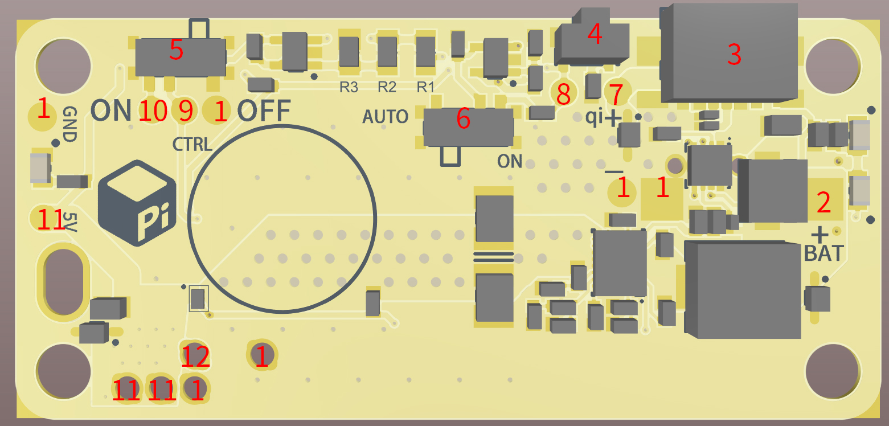
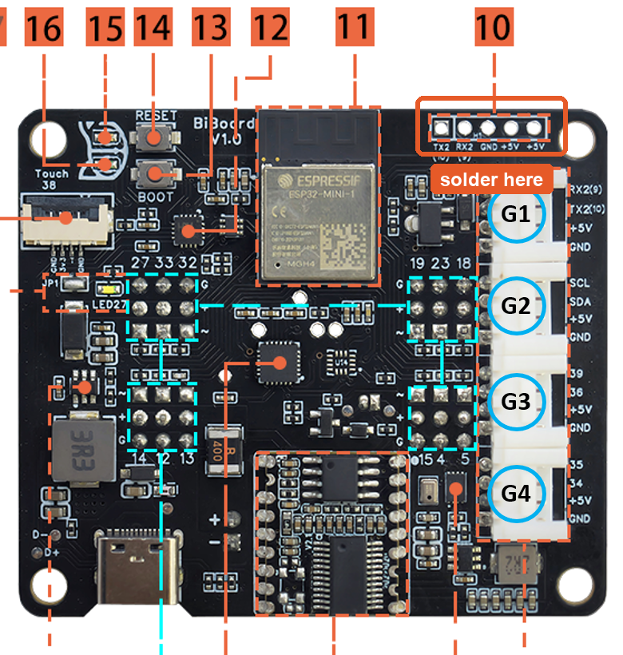

# Wiring PiSugar, the Pi, and BiBoard together

How G2's three electronics pieces connect: PiSugar (Pi power), the Raspberry
Pi Zero 2 W (voice/vision/memory), and BiBoard (walking/servos).

```
PiSugar S  --2 pogo pins (5V+GND), 4 screws, no wiring-->  Pi Zero 2 W  --3 wires (TX/RX/GND)-->  BiBoard V1
```

## What you'll need

- [ ] Raspberry Pi Zero 2 **WH** (header pre-soldered)
- [ ] PiSugar S, with its 4 mounting screws (included in the PiSugar box)
- [ ] BiBoard V1 — check whether Petoi included a ready-made BiBoard&harr;Pi
      cable in the Bittle X box before doing anything below; if so, skip to
      Step 3
- [ ] A 5-pin header to solder onto BiBoard, if one isn't already there
- [ ] Female-to-female Dupont jumper wires (3 needed; a 40-pack is cheap and
      the rest are reusable elsewhere)
- [ ] Soldering iron + solder, only if BiBoard's header isn't already
      populated

## Step 1 — Mount PiSugar to the Pi



Align PiSugar's 4 screw holes underneath the Pi and secure it with the
included screws. Two spring-loaded pogo pins on PiSugar make contact with two
pads on the underside of the Pi automatically — **5V and GND, power only**.

No wiring, no soldering, no pin diagram to check — the screw holes only line
up one way.

## Step 2 — Prepare BiBoard's Pi header

The connector is a 5-pin header at BiBoard's top edge, just above the servo
connectors (G1&ndash;G4):



If it isn't already populated, solder a 5-pin header there. Left to right:

| Pin | Label |
|---|---|
| 1 (square pad) | TX2 |
| 2 | RX2 |
| 3 | GND |
| 4 | +5V |
| 5 | +5V |

## Step 3 — Wire the Pi to BiBoard

Three wires, crossed — one board's "sending" line goes to the other's
"listening" line:

| From (BiBoard) | To (Pi) |
|---|---|
| TX2 | pin 10 (GPIO15, RXD) |
| RX2 | pin 8 (GPIO14, TXD) |
| GND | pin 6 |

Leave BiBoard's two +5V pins and the Pi's pin 2 (5V) **unconnected** — PiSugar
is already powering the Pi.

BiBoard side, zoomed &mdash; the three pins to wire are checked, the two +5V
pins are marked to skip:


Pi side, the other end of the same 3 wires &mdash; the relevant pins are the
first 5 columns of the header, nearest the microSD slot. Pin 1 (square,
top-left) orients you:


(The photo above shows a bare Pi Zero 2 W with unpopulated pads — your WH kit
ships with the header already soldered, so there's nothing to solder on the
Pi side, only on BiBoard's, in Step 2.)

## Step 4 — Before powering on

- [ ] Both of BiBoard's +5V pins are empty — no wire on either
- [ ] The Pi's pin 2 (5V) is empty
- [ ] BiBoard TX2 goes to Pi **pin 10**, not pin 8 (they're easy to swap)
- [ ] All 3 wires are seated firmly at both ends

## Reference

Full pinout, both boards:

| | BiBoard | Pi |
|---|---|---|
| Ground | GND | pin 6 |
| BiBoard sends / Pi receives | TX2 | pin 10 (RXD) |
| Pi sends / BiBoard receives | RX2 | pin 8 (TXD) |
| Power (not wired) | +5V, +5V | pin 2 |

An interactive version of the diagrams above — the Pi's full 40-pin header,
the PiSugar/Pi/BiBoard overview, and a combined view with the wires drawn
crossing between the two boards — is published at
[G2 Electronics Wiring](https://claude.ai/artifact/TBtEVxXmmQ97mHRgXyiuMq).

Source diagram (both sides of BiBoard, all 17 numbered components):
[`petoi-official-diagram.png`](images/biboard-pi-connector/petoi-official-diagram.png).

**Note:** BiBoard V1's spec sheet lists Pi compatibility as "Pi 3A+, 4, 5" —
the Pi Zero 2 WH isn't named. The pins used here (5V/GND/GPIO14/GPIO15) are
identical across every 40-pin Pi header including the Zero 2 W, so this is
expected to work regardless — worth a quick visual check of the header once
both boards are in hand.

### Sources

- [For BiBoard V1 | Petoi Doc Center](https://docs.petoi.com/apis/raspberry-pi-serial-port-as-an-interfac/for-biboard-v1)
- [BiBoard V1 Guide | Petoi Doc Center](https://docs.petoi.com/biboard/biboard-v1-guide) — source of the official board diagram
- [PiSugarS Series | PiSugar Docs](https://docs.pisugar.com/docs/product-wiki/battery/pisugar-s-series)
- [Raspberry PI Zero 2W TOP 02.jpg | Wikimedia Commons](https://commons.wikimedia.org/wiki/File:Raspberry_PI_Zero_2W_TOP_02.jpg) — CC BY-SA 4.0, source of the Pi Zero 2 W photos above
